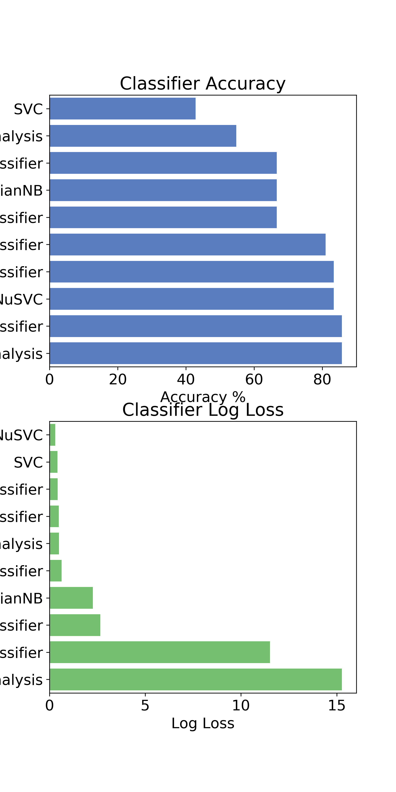
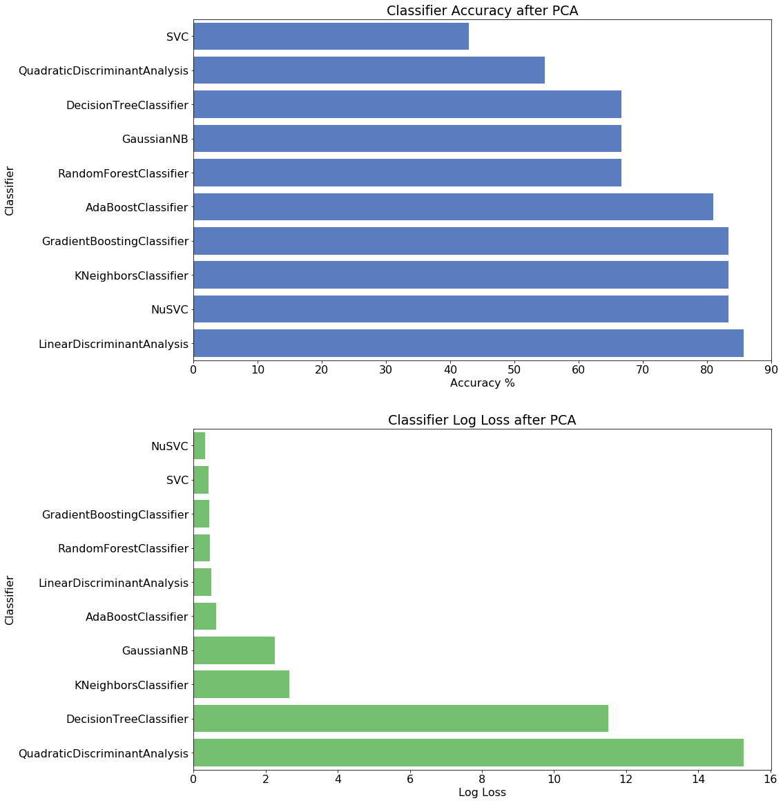

# Classification of rock vs. mine from sonar signals
The task is to create a model that predicts whether a sonar signal is a rock or a mine. 

The data set is available from [here](https://archive.ics.uci.edu/ml/datasets/Connectionist+Bench+(Sonar,+Mines+vs.+Rocks))

# Data analysis (see this [code]())
After loading the data and normalizing it, I used a bunch of different classifiers to see which one works better on this data. This list includes:

```python
# just trying a buch of classifiers to see which one is better
classifiers = [
    KNeighborsClassifier(3),
    SVC(kernel="rbf", C=0.025, probability=True),
    NuSVC(probability=True),
    DecisionTreeClassifier(),
    RandomForestClassifier(),
    AdaBoostClassifier(),
    GradientBoostingClassifier(),
    GaussianNB(),
    LinearDiscriminantAnalysis(),
    QuadraticDiscriminantAnalysis()]

```

So, the data was randomly then divided to test (20%) and train (80%) then feed into classifiers. The accuracy and log loss was stored for every classifier:


The results of classification.


As some of the features for two classes might have less contribution to overall separability, I then did PCA and only keep the most important dimensions and remove the rest keeping those that explain at least 95% of the total variance. Then, I did the classification again:


The results of classification after PCA.

As the best classifier turns out to be NuSVC, I decided to do some grid search to find the best parameters and do the classification again. The is the final results:


               precision |   recall | f1-score |  support
           --------------|----------|----------|---------
           M    |  0.64  |   0.89   |  0.74    |   18
           R    |  0.88  |   0.62   |  0.73    |   24
                |        |          |          |
   micro avg    |  0.74  |   0.74   |  0.74    |   42
   macro avg    |  0.76  |   0.76   |  0.74    |   42
weighted avg    |  0.78  |   0.74   |  0.74    |   42


